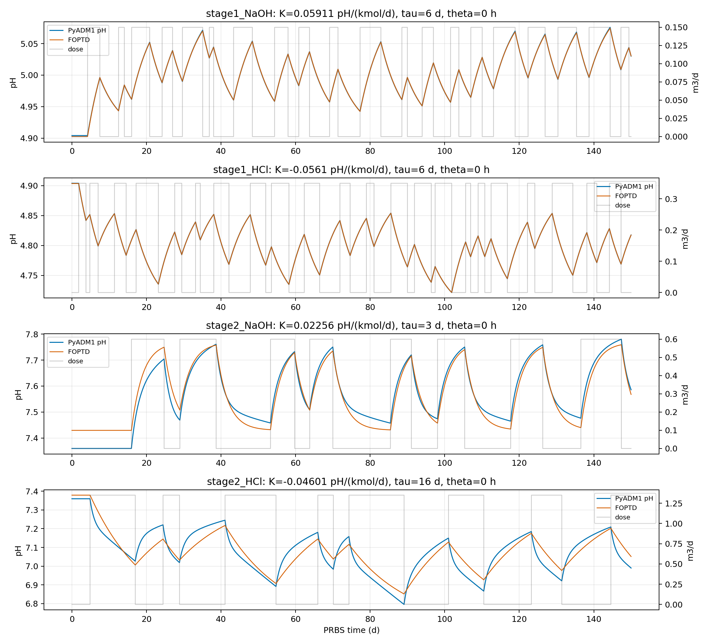
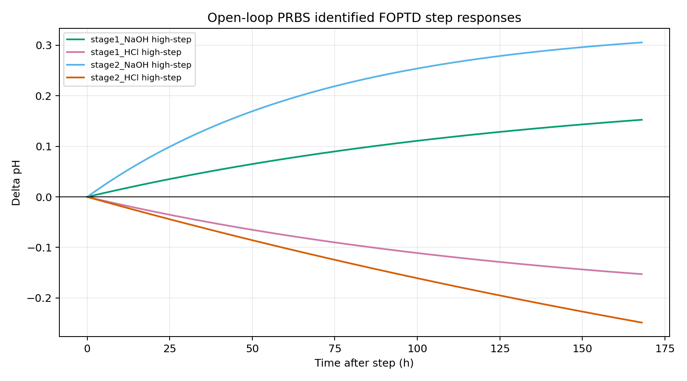
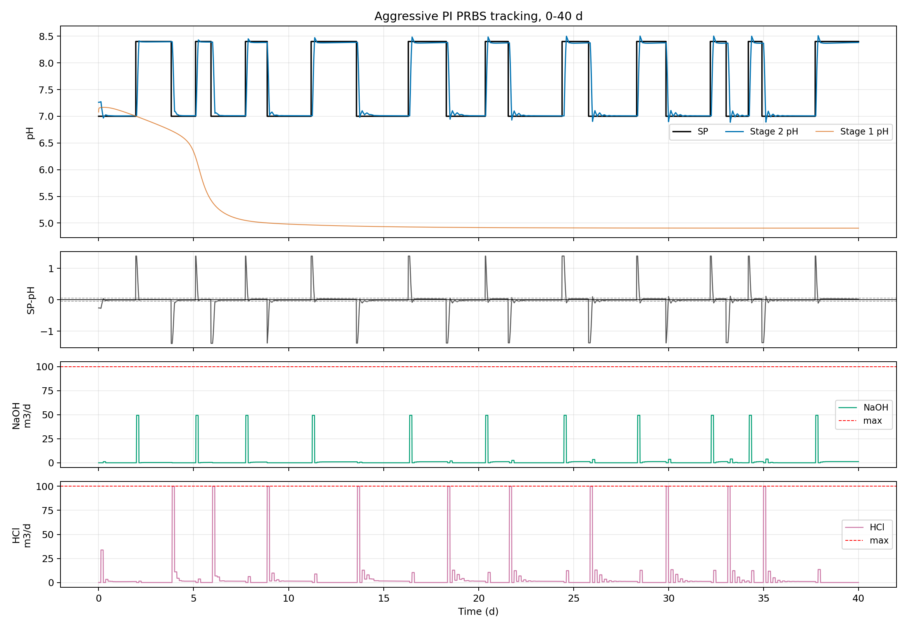
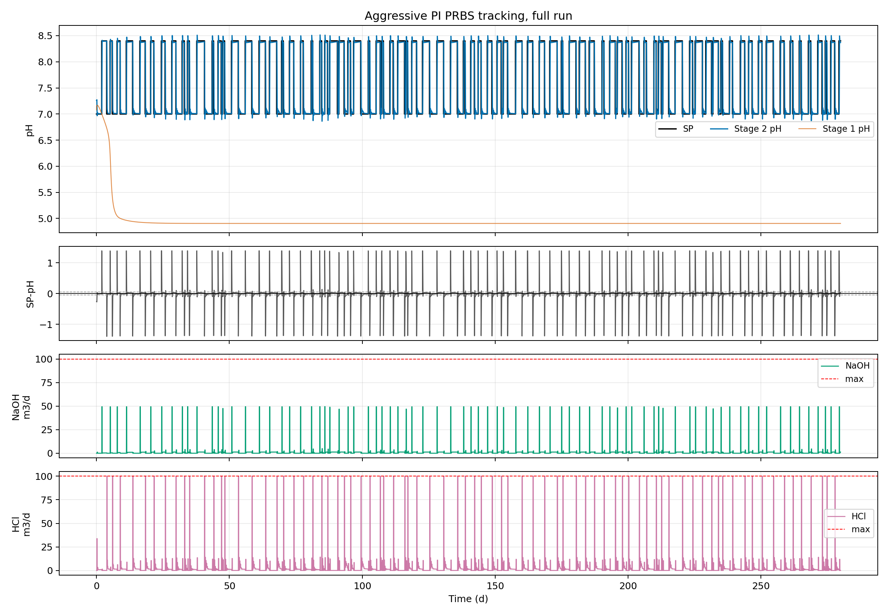
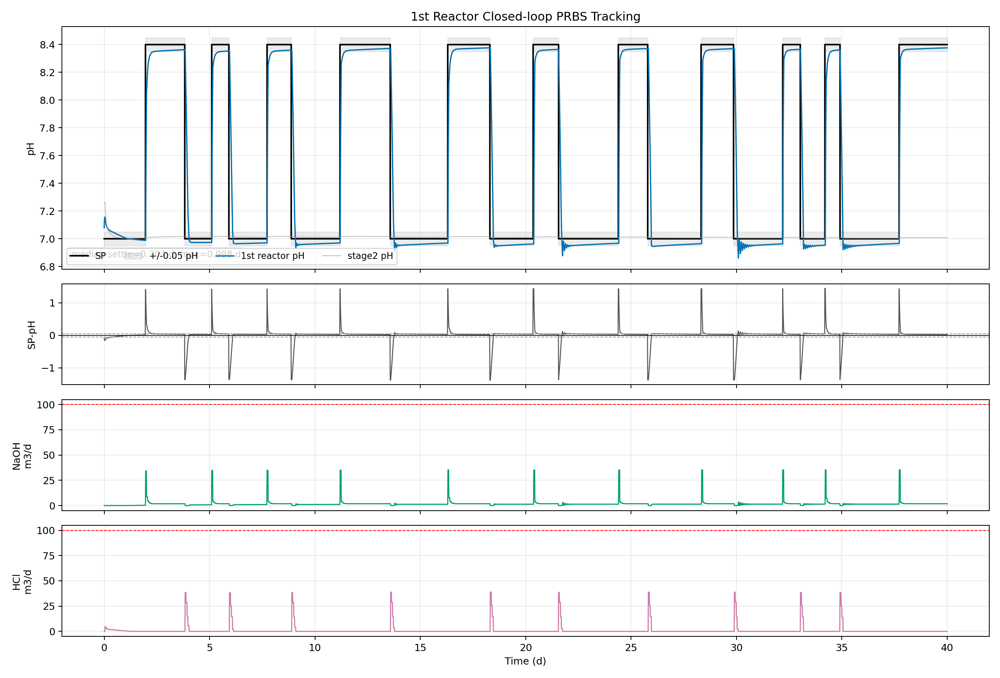
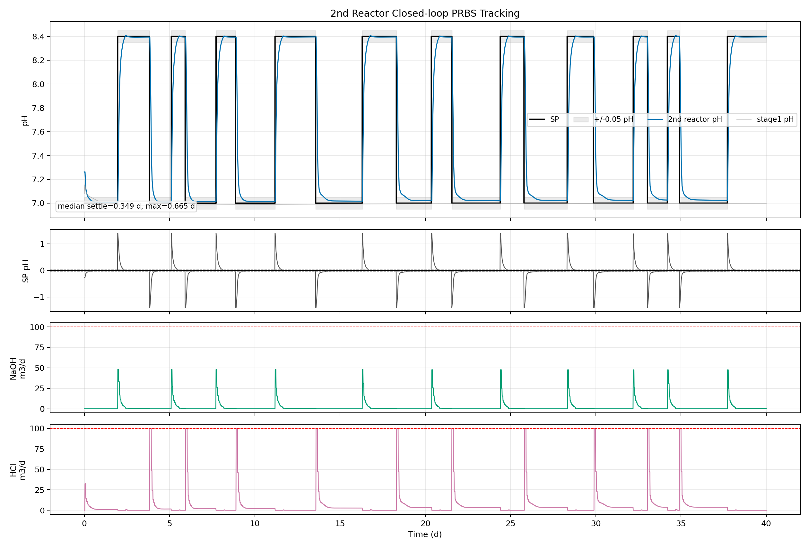

# 2-stage AD pH control: HRT 6/24 acid-base FOPTD and PI tuning

Date: 2026-07-30

This directory preserves the current two-stage PyADM1 pH-control result after changing the process split to 2:8 and HRT to 6 d / 24 d.

## Process configuration

- Stage 1: 55 degC, 20% of liquid/gas volume, 6 d HRT.
- Stage 2: 35 degC, 80% of liquid/gas volume, 24 d HRT.
- Stage 1 effluent feeds Stage 2 influent.
- Influent flow: 178.4674 m3/d.
- Liquid volumes: Stage 1 = 1070.8044 m3, Stage 2 = 4283.2176 m3.
- Base dosing: 25 M NaOH, represented as `S_cation` addition.
- Acid dosing: 35 wt% HCl, approximated as 11.3 kmol/m3, represented as `S_anion` addition.
- PI output update interval: 1 h. Model output/log interval: 15 min.
- PRBS setpoint: pH 7.0 / 8.4 with irregular 0.5-3.0 d dwell length, seed 260714.

## Open-loop FOPTD/FORTD models

The models below are fitted from separate open-loop PRBS tests for each reactor and chemical. The transfer-function form is:

```text
G(s) = K exp(-theta s) / (tau s + 1)
```

For the flow-basis model, `K` is pH/(m3/d), `tau` and `theta` are in days, and `s` is in 1/d.

| reactor | chemical | model_flow_basis | gain_pH_per_kmol_d | tau_d | theta_h | RMSE_pH | R2 |
| --- | --- | --- | --- | --- | --- | --- | --- |
| Stage 1 (55 degC) | NaOH | +1.477683 exp(-0.000s)/(6.000s+1) | +0.059107 | 6.000 | 0.00 | 0.0005 | 0.9998 |
| Stage 1 (55 degC) | HCl | -0.633947 exp(-0.000s)/(6.000s+1) | -0.056101 | 6.000 | 0.00 | 0.0002 | 1.0000 |
| Stage 2 (35 degC) | NaOH | +0.564044 exp(-0.000s)/(3.000s+1) | +0.022562 | 3.000 | 0.00 | 0.0343 | 0.9169 |
| Stage 2 (35 degC) | HCl | -0.519885 exp(-0.000s)/(16.000s+1) | -0.046008 | 16.000 | 0.00 | 0.0503 | 0.8119 |

`theta = 0` means the delay was not identifiable above the 15 min simulation/logging resolution. It should not be interpreted as proof of zero physical transport or mixing delay.

## Controller tuning used in code

The current code uses 1 h PI output updates. Stage 1 gains were re-tuned from the earlier 3 h setting to prioritize fast reactor-specific tracking over intentional NaOH overshoot. Stage 2 retains the previous aggressive FOPTD/IMC gains and is re-verified at the 1 h update interval.

| reactor | chemical | Kp_m3_d_per_pH | Ki_m3_d_per_pH_d | active_in_stage_specific_prbs |
| --- | --- | --- | --- | --- |
| Stage 1 | NaOH | 24.000000 | 4.800000 | True |
| Stage 1 | HCl | 28.000000 | 5.600000 | True |
| Stage 2 | NaOH | 34.039882 | 11.346627 | True |
| Stage 2 | HCl | 123.104132 | 7.694008 | True |

The reactor-specific PRBS verification script controls the selected reactor setpoint while holding the other reactor at pH 7.0.

## Reactor-specific 1 h closed-loop PRBS result

The table below summarizes the 40 d reactor-specific PRBS check. Settling time is the first time after a setpoint change when the controlled reactor enters and remains inside +/-0.05 pH. The filtered values use only up/down PRBS segments with dwell time >= 1 d.

| reactor | median_settle_ge1d_d | max_settle_ge1d_d | ge1d_segments_under_1d | up_max_overshoot_pH | down_max_undershoot_pH | q_NaOH_max_m3_d | q_HCl_max_m3_d | saturation_note |
| --- | --- | --- | --- | --- | --- | --- | --- | --- |
| Stage 1 | 0.280586 | 0.998221 | 18/18 | 0.000000 | 0.138934 | 35.348207 | 38.873879 | no saturation |
| Stage 2 | 0.355494 | 0.664888 | 18/18 | 0.009003 | 0.000000 | 48.302000 | 100.000000 | HCl saturation fraction 0.023431 |

## Previous serial Stage 2 PRBS result

The files below are retained from the earlier serial Stage 2 PRBS run and are useful for comparison, but the current fast-tracking code inputs are the 1 h reactor-specific values listed above. ITAE is computed segment by segment as `integral(t_rel * abs(pH_sp - pH_stage2) dt)`, where `t_rel = t - segment_start`. Segment ITAE values are summed for the total score.

| metric | value | unit |
| --- | --- | --- |
| total_IAE | 32.134668 | pH*d |
| total_ITAE | 7.163673 | pH*d^2 |
| mean_abs_error_time_weighted | 0.114767 | pH |
| mean_segment_ITAE | 0.044773 | pH*d^2 |
| median_segment_ITAE | 0.042290 | pH*d^2 |
| settled_fraction_0p05 | 0.975000 | - |
| median_settle_time_0p05 | 0.296126 | d |
| max_settle_time_0p05 | 0.915160 | d |

Overshoot and pump saturation summary from that previous serial PRBS check:

| metric | value | unit |
| --- | --- | --- |
| up_max_overshoot_pH | 0.114186 | pH |
| up_mean_overshoot_pH | 0.087812 | pH |
| down_max_undershoot_pH | 0.138345 | pH |
| q_NaOH_max_m3_d | 49.482616 | m3/d |
| q_HCl_max_m3_d | 100.000000 | m3/d |
| NaOH_sat_fraction | 0.000000 | - |
| HCl_sat_fraction | 0.035267 | - |

## Key figures

### Open-loop FOPTD fit by reactor and chemical



### Open-loop step responses



### Fast PI PRBS tracking, 0-40 d



### Fast PI PRBS tracking, full 280 d



### Reactor-specific closed-loop PRBS tracking





## Contents

- `code/`
  - Current pH-control PyADM1 scripts and local identification/analysis scripts.
- `results/openloop_prbs_foptd_params_by_reactor_chemical.csv`
  - Reactor-specific NaOH/HCl FOPTD fit parameters.
- `results/controller_tuning_parameters.csv`
  - PI gains currently entered in the code, with the linked FOPTD values.
- `results/controller_actual_input_values.csv`
  - Actual process, dosing, PRBS, and control constants used by the scripts.
- `results/fast_pi_prbs_itae_summary.csv`
  - Full-run ITAE, IAE, settling, and pump-use metrics.
- `results/fast_pi_prbs_segment_itae.csv`
  - Segment-level IAE/ITAE and dosing metrics.
- `results/acid_base_control_log_2stage_serial_PRBS.csv`
  - Latest 280 d PRBS tracking log used for the ITAE calculation.
