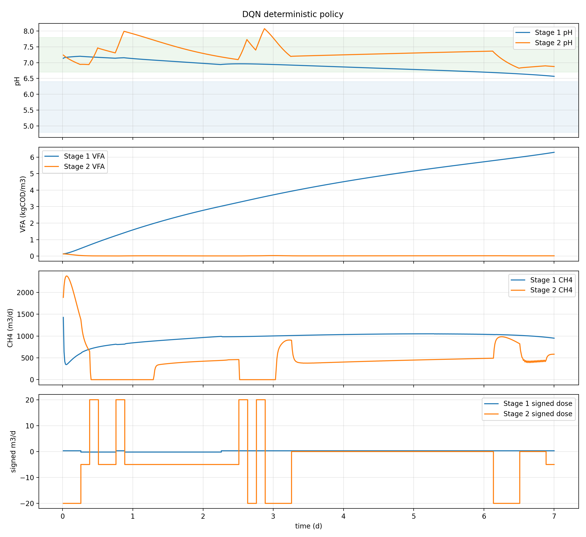
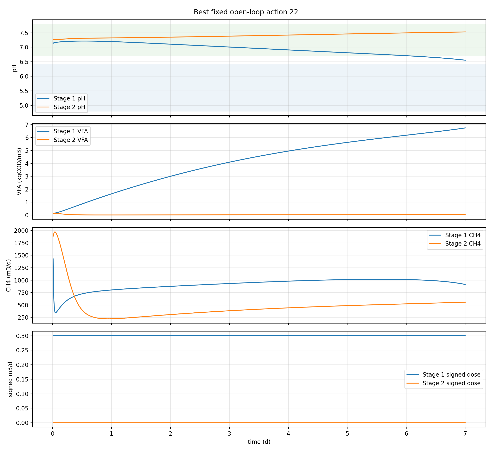
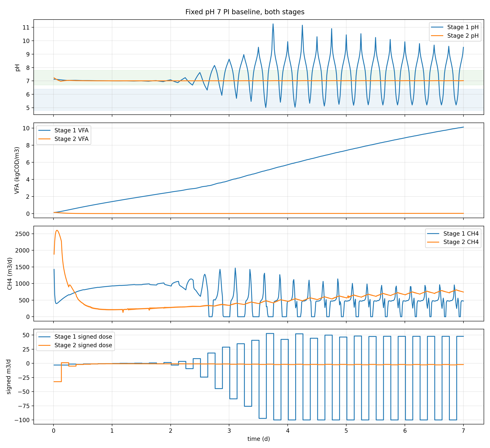
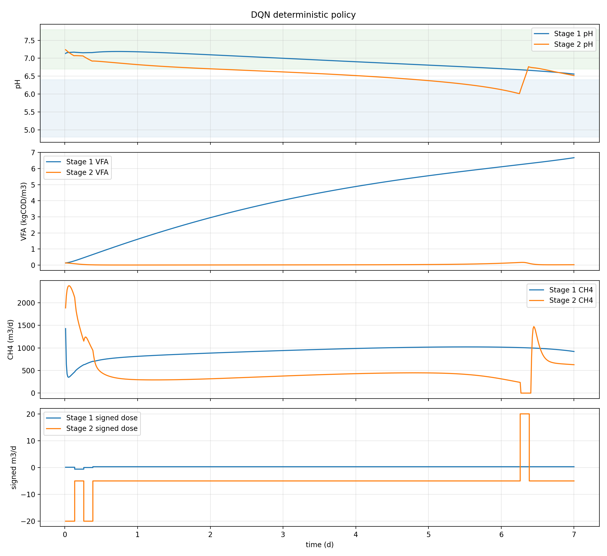
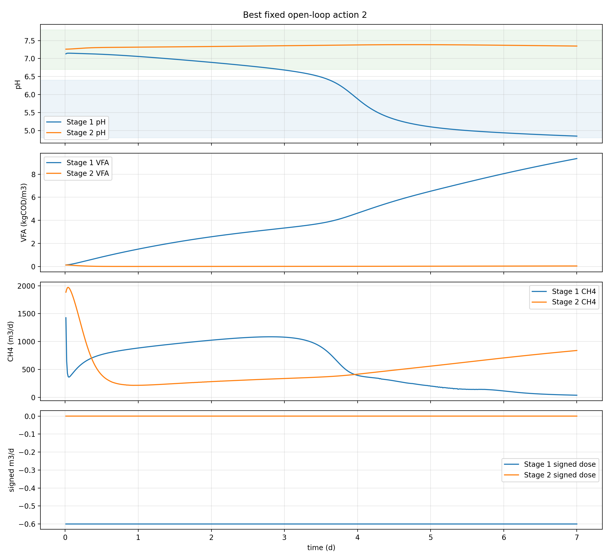
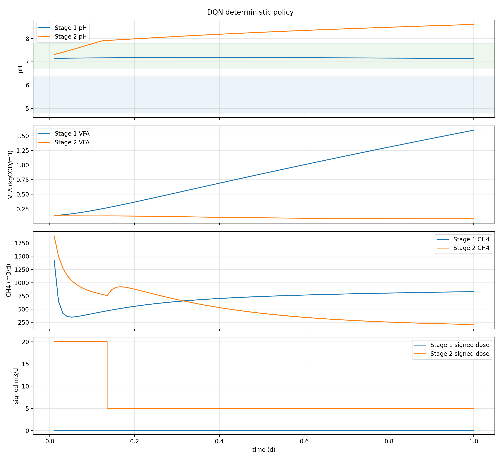
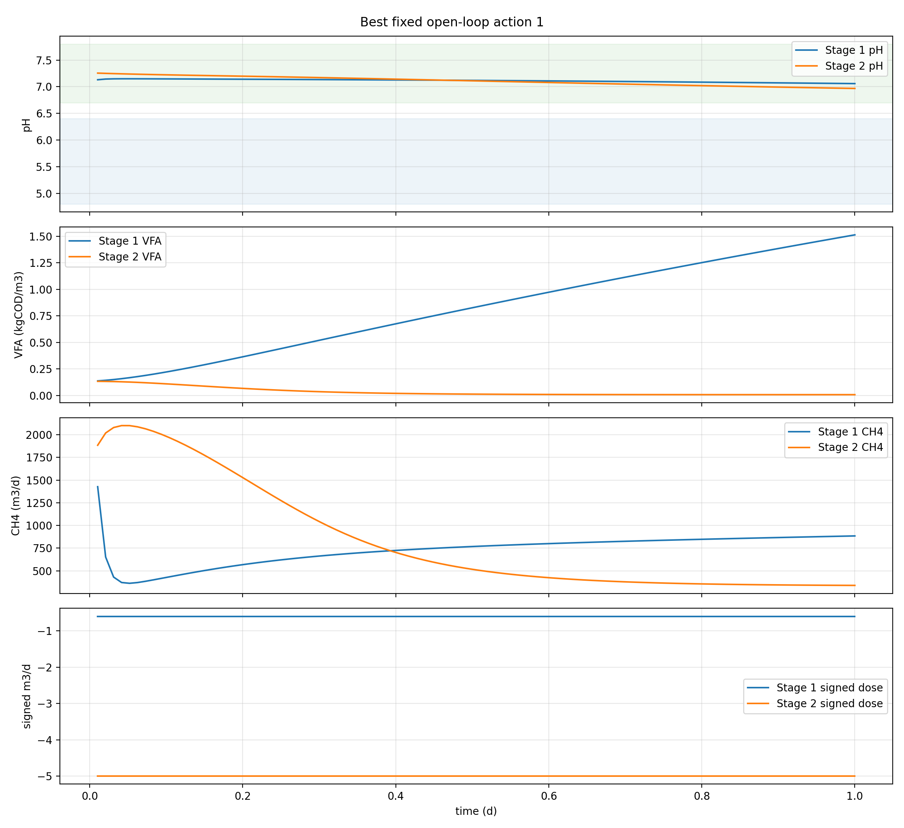

# 2-stage pH direct-dosing DQN experiment

Date: 2026-07-30

This experiment starts the RL formulation for the 2-stage ADM1 pH-control problem:

- Stage 1: 55 degC, 6 d HRT, objective is acidogenic conversion to VFA.
- Stage 2: 35 degC, 24 d HRT, objective is conversion/removal of incoming VFA and methane production.
- Manipulated variables are four dosing flows:
  - Stage 1 NaOH
  - Stage 1 HCl
  - Stage 2 NaOH
  - Stage 2 HCl
- Chemical use is penalized in the reward.

## Initial DQN action space

DQN uses a discrete action table. To avoid wasting chemical by adding acid and base to the same reactor in the same interval, each reactor uses one signed dosing command:

- Negative signed flow = HCl dosing.
- Positive signed flow = NaOH dosing.
- Zero signed flow = no dosing.

Default levels:

```text
Stage 1 signed flow, m3/d: [-0.60, -0.20, 0.00, +0.10, +0.30]
Stage 2 signed flow, m3/d: [-20.0, -5.0, 0.0, +5.0, +20.0]
```

The Cartesian product gives 25 DQN actions and still covers all four physical pumps.

## Reward

For each 3 h decision interval:

```text
benefit =
    1.0 * total_CH4_m3

cost =
    0.2 * total_chemical_kmol
  + pH_violation_weight * integrated_pH_violation

reward = (benefit - cost) / reward_scale
```

The default reward mode is now `methane_total`, with `chemical_kmol_weight = 0.2` and `pH_violation_weight = 500`. Stage 1 VFA production, Stage 2 VFA removal, Stage 2 VFA conversion, and CH4/VFA-in are still logged as diagnostics. The previous mixed objective is still available with `--reward-mode staged_vfa_ch4`.

Default safety bands:

- Stage 1 pH: 4.8 to 6.4
- Stage 2 pH: 6.7 to 7.8

These are starting values for exploration, not final process limits.

## Baseline comparison

Two baseline families are implemented.

The fixed dosing open-loop baseline is implemented as a static dosing action:

- The same action from the 25-action table is applied every decision interval.
- A grid evaluation checks all fixed actions and reports the best fixed open-loop policy.
- DQN is compared against that best fixed action and the zero-dosing action.

The fixed pH 7 SP baseline is implemented as feedback PI control:

- Stage 1 pH SP = 7.0.
- Stage 2 pH SP = 7.0.
- The reactor-specific NaOH/HCl PI gains from the FOPTD tuning package are used.
- Both stages may dose acid/base, but each stage PI chooses only one direction at a time.

## Run

From the repository root:

```powershell
python .\experiments\pH_control_2stage_rl_dqn_20260730\code\train_dqn_4actuator.py --episodes 5 --episode-days 2 --run-name ph2stage_dqn_4actuator_smoke
```

Faster syntax check without the baseline grid:

```powershell
python .\experiments\pH_control_2stage_rl_dqn_20260730\code\train_dqn_4actuator.py --episodes 1 --episode-days 0.25 --run-name ph2stage_dqn_quickcheck --skip-baselines
```

## Outputs

Each run writes to:

```text
experiments/pH_control_2stage_rl_dqn_20260730/runs/<run-name>/
```

Important files:

- `action_table.csv`
- `config.json`
- `training_steps.csv`
- `episode_summary.csv`
- `dqn_policy_decision_steps.csv`
- `dqn_policy_internal_timeseries.csv`
- `baseline_fixed_action_summary.csv`
- `baseline_fixed_pH7_PI_decision_steps.csv`
- `comparison_summary.csv`
- `dqn_policy_rollout.png`
- `baseline_best_action_rollout.png`
- `baseline_fixed_pH7_PI_rollout.png`

## 7 d / 100 episode methane-reward comparison, chemical weight 0.2

This run uses a 7 d horizon, 100 DQN training episodes, the full 25-action fixed dosing grid, the fixed pH 7 PI baseline, the default `methane_total` reward, and `chemical_kmol_weight = 0.2`.

```powershell
python .\experiments\pH_control_2stage_rl_dqn_20260730\code\train_dqn_4actuator.py --episodes 100 --episode-days 7.0 --run-name ph2stage_dqn_7d_100ep_methane_reward_chem0p2_compare
```

| Policy | Reward | Raw reward | Chemical use |
| --- | ---: | ---: | ---: |
| DQN deterministic after 100 episodes | 79.4787 | 7947.8737 | 666.988 kmol |
| Best fixed dosing open-loop | 77.0218 | 7702.1781 | 52.500 kmol |
| Zero dosing open-loop | 73.3706 | 7337.0637 | 0.000 kmol |
| Fixed pH 7 PI, both stages | 29.6599 | 2965.9902 | 5006.192 kmol |

Best fixed dosing action in this methane-reward, chem0p2 check:

```text
action = 22
Stage 1: NaOH 0.3 m3/d
Stage 2: no dosing
```

Interpretation: increasing the chemical penalty from 0.03 to 0.2 reduced DQN chemical use from about 1045 kmol to about 667 kmol while keeping DQN slightly ahead of the best fixed dosing baseline. Chemical use is still much higher than the best fixed dosing action, so 0.2 is a reasonable balanced starting point, not the final penalty.

Detailed outputs:

- `results/dqn_7d_100ep_methane_reward_chem0p2_comparison_summary.csv`
- `results/dqn_7d_100ep_methane_reward_chem0p2_baseline_fixed_action_summary.csv`
- `results/dqn_7d_100ep_methane_reward_chem0p2_episode_summary.csv`
- `results/dqn_7d_100ep_methane_reward_chem0p2_policy_decision_steps.csv`
- `results/dqn_7d_100ep_methane_reward_chem0p2_fixed_pH7_PI_decision_steps.csv`

### 7 d methane-reward chem0p2 DQN rollout



### 7 d methane-reward chem0p2 best fixed dosing rollout



### 7 d methane-reward chem0p2 fixed pH 7 PI rollout



## 7 d / 100 episode methane-reward comparison, chemical weight 0.03

This previous run used the same `methane_total` reward but a weaker chemical penalty, `chemical_kmol_weight = 0.03`.

| Policy | Reward | Raw reward | Chemical use |
| --- | ---: | ---: | ---: |
| DQN deterministic after 100 episodes | 79.5510 | 7955.1044 | 1045.188 kmol |
| Best fixed dosing open-loop | 77.1110 | 7711.1031 | 52.500 kmol |
| Zero dosing open-loop | 73.3706 | 7337.0637 | 0.000 kmol |
| Fixed pH 7 PI, both stages | 38.1704 | 3817.0428 | 5006.192 kmol |

Detailed outputs:

- `results/dqn_7d_100ep_methane_reward_comparison_summary.csv`
- `results/dqn_7d_100ep_methane_reward_baseline_fixed_action_summary.csv`
- `results/dqn_7d_100ep_methane_reward_episode_summary.csv`
- `results/dqn_7d_100ep_methane_reward_policy_decision_steps.csv`
- `results/dqn_7d_100ep_methane_reward_fixed_pH7_PI_decision_steps.csv`

## 7 d / 100 episode staged-reward comparison

This previous run uses the older `staged_vfa_ch4` reward with VFA production/removal plus Stage 2 methane.

```powershell
python .\experiments\pH_control_2stage_rl_dqn_20260730\code\train_dqn_4actuator.py --episodes 100 --episode-days 7.0 --run-name ph2stage_dqn_7d_100ep_compare --reward-mode staged_vfa_ch4
```

| Policy | Reward | Raw reward | Chemical use |
| --- | ---: | ---: | ---: |
| DQN deterministic after 100 episodes | 80.5805 | 8058.0547 | 544.160 kmol |
| Best fixed dosing open-loop | 106.3714 | 10637.1429 | 47.460 kmol |
| Zero dosing open-loop | 94.1400 | 9413.9970 | 0.000 kmol |
| Fixed pH 7 PI, both stages | 87.6819 | 8768.1856 | 5006.192 kmol |

Best fixed dosing action in this 7 d check:

```text
action = 2
Stage 1: HCl 0.6 m3/d
Stage 2: no dosing
```

Interpretation: under the current reward weights and action grid, the 100-episode DQN has not yet beaten the best fixed dosing baseline. The fixed pH 7 PI baseline controls pH using much more chemical, so its reward is lower than zero dosing despite active feedback.

Detailed outputs:

- `results/dqn_7d_100ep_comparison_summary.csv`
- `results/dqn_7d_100ep_baseline_fixed_action_summary.csv`
- `results/dqn_7d_100ep_episode_summary.csv`
- `results/dqn_7d_100ep_policy_decision_steps.csv`
- `results/dqn_7d_100ep_fixed_pH7_PI_decision_steps.csv`

### 7 d DQN rollout



### 7 d best fixed dosing rollout



### 7 d fixed pH 7 PI rollout


## 1 d pipeline check

A short 3-episode, 1 d run was executed only to verify the full pipeline. This is not a trained-policy performance claim.

| Policy | Reward | Raw reward | Chemical use | Stage 2 VFA conversion | Stage 2 CH4/VFA in |
| --- | ---: | ---: | ---: | ---: | ---: |
| DQN deterministic after 3 smoke episodes | -2.7227 | -272.2674 | 174.375 kmol | 0.7885 | 7.6110 |
| Best fixed open-loop action | 0.1222 | 12.2150 | 63.280 kmol | 0.8822 | 13.3937 |
| Zero dosing open-loop | -0.1096 | -10.9575 | 0.000 kmol | 0.8782 | 11.9930 |
| Fixed pH 7 PI, both stages | 0.2652 | 26.5182 | 83.306 kmol | not shown | not shown |

Best fixed open-loop action in this 1 d check:

```text
action = 1
Stage 1: HCl 0.6 m3/d
Stage 2: HCl 5.0 m3/d
```

Detailed outputs:

- `results/pipeline_check_1d_comparison_summary.csv`
- `results/pipeline_check_1d_baseline_fixed_action_summary.csv`
- `results/action_table.csv`

### DQN smoke rollout



### Best fixed open-loop rollout



## Notes

This is the first executable RL formulation. It is intentionally conservative:

- The action grid is small enough for DQN smoke tests.
- Stage-wise simultaneous acid/base dosing is excluded.
- The fixed open-loop comparison is static dosing, not feedback PI.
- If the desired baseline is fixed pH setpoint PI instead of fixed dosing, add that as a second baseline policy before long training.
